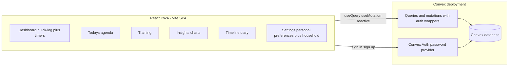

# Pawgress — Puppy Progress & Routine PWA

A mobile-first progressive web app (with a solid desktop layout) for logging and visualizing a puppy's daily life: potty, sleep, meals, walks, enrichment, training, and daily agenda — built on Convex + TypeScript, multi-user, multi-dog.

## 1. Scope

### In scope (v1)

- **Accounts & onboarding**: Email + password login (Convex Auth). Onboarding wizard collects puppy name, birthday, current weight, and meal routine times.
- **Multi-dog, multi-user**: Each dog belongs to a household; multiple accounts can be invited to log for the same dog. A user can have multiple dogs and switch between them.
- **Quick logging dashboard (default view)**:
  - One-tap buttons: pee, poop, meal, treat, woke up, fell asleep, walk start, walk end.
  - Every log can be backdated ("this happened 20 minutes ago" / pick a time).
  - Live timers: time since last meal, countdown to next scheduled meal, time since woke up _or_ time since fell asleep (whichever state is current), time since last pee/poop, time since last walk.
- **Walks**: start/end (duration), potty events attached to a walk, free-text walk diary ("loud bicycle, played with children").
- **Sleep tracking**: wake/sleep events producing awake/asleep intervals.
- **Meals**: log a meal with optional amount; configurable meal schedule (routine) drives the "next meal" countdown.
- **Enrichment & play**: log activities from a configurable list (seeded with lick mat, snuffle mat, towel burrito, scatter feeding, tug, fetch...); users can add/archive their own activity types.
- **Training**: commands with name, description, "how to train" notes, and a progress status; training sessions logged against commands with a rating and notes.
- **Today's agenda**: per-day enrichment goals, training goals (checkable), today's win, day rating (1–5), and a diary entry explaining the rating.
- **Body tracking**: weight entries over time plus optional measurements (neck, chest, back length); age displayed from birthday.
- **Timeline / diary view**: chronological, filterable log of all events per day.
- **Insights / visualizations**:
  - Weight over time (line chart).
  - Potty patterns: pee/poop frequency by hour of day (heatmap/histogram).
  - Walk analysis: intervals between walks, with markers for meals occurring between walks.
  - Sleep totals per day.
  - Day ratings over time.
- **Localization & personal settings**: Complete English and Slovak UI,
  locale-aware dates/numbers/durations, and a per-user language preference that
  follows the signed-in account across devices. User-authored household content
  is always shown exactly as entered.
- **PWA**: installable (manifest + service worker for app-shell caching), mobile-first UI, responsive desktop layout (multi-column dashboard).

### Out of scope (v1)

- Offline logging with sync (online-only PWA; offline shows a "reconnecting" state).
- Push notifications / reminders (possible later via scheduled functions + web push).
- Photo uploads (Convex file storage makes this an easy v2 addition).
- Monetization, teams/orgs beyond simple dog sharing, native apps.

## 2. Architecture

### Tech stack

- **Backend**: Convex (database, functions, real-time reactivity, scheduled functions if needed). Convex Auth (`@convex-dev/auth`) with the Password provider — no external auth service.
- **Frontend**: Vite + React 19 + TypeScript SPA.
  - Routing: React Router.
  - Styling/UI: Tailwind CSS + shadcn/ui components.
  - Charts: Recharts.
  - Localization: i18next + react-i18next with synchronous typed English and
    Slovak catalogs; native `Intl` for locale-aware dates, numbers, and plurals.
  - Dates: date-fns; PWA: `vite-plugin-pwa`.
- **Tooling**: ESLint with `@convex-dev/eslint-plugin`, TypeScript strict mode, Vitest + `convex-test`.
- **Deployment**: Convex Cloud (free tier) + Cloudflare Pages for the static SPA.
  One command deploy: `npx convex deploy` + the Pages host build.

### System overview

### Data model (Convex schema)

- `users`, `authSessions`, etc. — provided by Convex Auth `authTables`.
- `userPreferences`: `{ userId, locale: "en" | "sk" }` — index `by_user`, one
  optional preference document per authenticated user. A separate table avoids
  coupling application preferences to the Convex Auth-owned `users` schema.
- `dogs`: `{ name, birthday: "YYYY-MM-DD", breed?, sex?, timezone, createdBy }`
- `dogMembers`: `{ dogId, userId, role: "owner" | "member" }` — indexes `by_dog`, `by_user`, `by_dog_user`. All data access is authorized through this table.
- `invites`: `{ dogId, code, createdBy, status }` — join a household via invite code (avoids needing email sending).
- `events` — single unified timeline table for everything time-stamped:
  - `{ dogId, userId, kind, at: number, endedAt?: number, note?, activityTypeId?, amount?, walkId? }`
  - `kind`: `"pee" | "poop" | "meal" | "treat" | "wake" | "sleep" | "walk" | "play" | "note"`
  - Duration events (`walk`, optionally `play`) use `endedAt`; an in-progress walk is a walk event with no `endedAt`.
  - Potty events during a walk carry `walkId` pointing at the walk event.
  - Indexes: `by_dog_at ["dogId", "at"]`, `by_dog_kind_at ["dogId", "kind", "at"]`.
- `activityTypes`: `{ dogId, name, emoji?, isArchived }` — configurable enrichment/play list, defaults seeded at dog creation.
- `routines`: `{ dogId, kind: "meal", label, timeOfDay: "HH:mm" }` — drives next-meal countdown; extensible to other routine kinds later.
- `trainingCommands`: `{ dogId, name, description?, howToTrain?, status: "learning" | "solid" | "mastered", isArchived }`
- `trainingSessions`: `{ dogId, commandId, at, rating: 1-5, notes? }` — index `by_command`, `by_dog_at`.
- `agendaDays`: `{ dogId, date: "YYYY-MM-DD", enrichmentGoals: [{ text, done }], trainingGoals: [{ text, done }], win?, rating?, diary? }` — index `by_dog_date` (unique per dog+day).
- `bodyMetrics`: `{ dogId, at, weightKg?, neckCm?, chestCm?, backCm? }` — index `by_dog_at`.

### Key design decisions

- **Unified `events` table** keeps the timeline, dashboard timers, and insights queries simple (one indexed range scan per day), while structured domains (training, agenda, body metrics, routines) get their own tables.
- **Auth wrappers instead of repeated checks**: `authedQuery`/`authedMutation` (via `convex-helpers` custom functions) resolve the current user; `dogQuery`/`dogMutation` additionally take a `dogId` arg and verify membership through `dogMembers`. Every public function uses one of these, plus `args`/`returns` validators.
- **No `Date.now()` in queries**: queries take day boundaries / "now" from the client as arguments. Live timers ("2h 13m since last meal") are computed client-side with a 30s ticking interval from the reactive "latest event per kind" query result — so timers stay live and queries stay cacheable.
- **Timezone**: stored per dog; the client computes local `date` strings ("YYYY-MM-DD") and day-boundary timestamps and passes them to queries, so "today" is always the household's day.
- **Locale is user-scoped, timezone is dog-scoped**: a persisted user preference
  controls product copy and presentation formatting only. Dog-local bucketing,
  timestamps, and `YYYY-MM-DD` keys remain unchanged. Locale resolution is the
  persisted preference, then the first supported browser language, then English.
- **Translation boundary**: all product-owned copy, accessible names, validation
  messages, enum labels, and chart text are translated. Dog names, notes,
  diaries, custom activities, commands, and other household-authored values are
  never machine-translated. Built-in meal/activity defaults are localized when
  first seeded, then remain ordinary shared household data rather than changing
  when another member selects a different locale.
- **Sharing model**: invite codes rather than email invites — a member generates a code, another user redeems it. Zero email infrastructure.
- **PWA**: `vite-plugin-pwa` generates the manifest and a service worker that precaches the app shell; data always comes live from Convex over WebSocket. iOS/Android installable.

### Frontend routes

- `/login`, `/onboarding` (dog + routines setup)
- `/` — dashboard (quick log + timers + today summary)
- `/timeline` — day-by-day event diary
- `/agenda` — today's goals, win, rating, diary
- `/training` — commands list, command detail, session logging
- `/insights` — charts
- `/settings` — Personal settings (account + language) and Household settings
  (members/invites, join flow, dog switcher); extends the existing sharing page
  rather than creating a second settings route

## 3. Milestones

1. **Scaffolding** — Vite + React + TS strict, Convex project, Tailwind + shadcn/ui, ESLint (incl. Convex plugin), Vitest + convex-test, basic CI-ready scripts.
2. **Auth + onboarding** — Convex Auth password sign-up/sign-in, onboarding wizard (dog name, birthday, weight, meal times), dog creation with seeded activity types, auth wrapper functions (`authedQuery`, `dogQuery`, ...).
3. **Event core + dashboard** — `events` table, quick-log mutations (with backdating), latest-event queries, dashboard with one-tap buttons, live timers, undo/edit/delete of recent logs.
4. **Walks + sleep** — walk start/end flow, walk diary, potty-during-walk linking, wake/sleep state machine, awake/asleep timer on dashboard.
5. **Enrichment + training** — activity type management, play/enrichment logging, training commands CRUD, training session logging with ratings.
6. **Today's agenda** — agenda day document, goal checklists, win/rating/diary, agenda summary card on dashboard.
7. **Timeline + insights** — filterable daily timeline, weight/body metrics entry, charts (weight, potty-by-hour, walk intervals with meal markers, sleep per day, day ratings).
8. **Sharing** — invite code generation/redemption, member list, multi-dog switcher.
9. **Localization + settings** — complete English and Slovak catalogs, persisted
   per-user locale, locale-aware formatting and plurals, and an accessible
   Personal + Household Settings page built on the existing `/settings` route.
10. **PWA + desktop polish + deploy** — manifest/icons/service worker, install
    prompt guidance, responsive desktop grid layout, production deploy
    preparation for Convex + Cloudflare Pages, and README setup/deploy guidance.

Milestones 1–3 produce a usable daily-driver; everything after adds depth.

## 4. Risks

- **Convex Auth maturity**: `@convex-dev/auth` is still officially beta. Mitigation: it's first-party, actively released (Feb 2026), and used widely; auth surface is small (password only). Fallback: Better Auth Convex component with minimal schema impact since we key everything off `userId`.
- **Timer correctness vs. reactivity**: computing "time since X" wrongly (server-side `Date.now()`) would break caching or go stale. Mitigation: the client-tick pattern above; unit-test the derivation logic.
- **Timezone/day-boundary bugs**: agenda and "today" views are date-keyed; travelling or DST could mis-bucket events. Mitigation: single shared date utility, dog-level timezone, tests around midnight/DST boundaries.
- **Unified events table churn**: if event kinds later need very different payloads, the union validator grows awkward. Mitigation: keep payload fields optional and minimal; structured domains already live in separate tables.
- **Concurrent household edits**: two people logging simultaneously (e.g., both end a walk). Convex mutations are transactional and the UI is reactive, so conflicts are limited; mutations will be written idempotently where it matters (e.g., "end walk" targets a specific walk id).
- **iOS PWA quirks**: install flow and WebSocket behavior in background tabs. Mitigation: Convex client auto-reconnects; test on a real iPhone early (milestone 3, not 9).
- **Event volume growth**: a year of logging is tens of thousands of events. All queries use indexed range scans (`by_dog_at`) with day/window bounds and pagination on the timeline — no unbounded `.collect()`.
- **Translation completeness**: the current UI has a large English literal
  surface. Mitigation: catalog key-parity tests, representative Slovak coverage
  for every route, and no raw translation keys rendered in production.
- **Slovak grammar and formatting**: plurals, decimal commas, dates, and compact
  durations differ from English. Mitigation: i18next plural rules, explicit
  `Intl` locales, tests for Slovak 1 / 2–4 / 5+ forms, and human-language review.
- **Preference loading flash**: authenticated pages could briefly render the
  wrong language. Mitigation: resolve the authenticated preference before
  protected route content renders; signed-out screens use deterministic browser
  fallback.
- **Locale/timezone confusion**: changing Slovak/English must never rebucket a
  household day. Mitigation: pass locale and dog timezone as separate values and
  retain the existing DST/day-boundary suite.

## 5. Acceptance criteria

- **Auth**: A new user can sign up with email + password, complete onboarding (dog name, birthday, weight, meal times), and land on the dashboard. Signed-out users can access nothing but login. No Convex function returns data for a dog the caller isn't a member of.
- **Quick logging**: From the dashboard, logging a pee takes one tap; the "since last pee" timer updates within a second on all connected devices. Any event can be logged with a past timestamp and can be edited or deleted afterwards.
- **Timers**: Dashboard shows time since last meal, countdown to next scheduled meal (from the routine), time since last pee/poop, time since last walk, and awake/asleep duration matching the latest wake/sleep event.
- **Walks**: "Walk start" then "walk end" creates one walk with correct duration; potty logged mid-walk appears attached to the walk; a diary note can be added to the walk.
- **Enrichment**: A custom activity type ("cafe visit") can be created and then logged; archived types no longer appear in the picker but old logs still render.
- **Training**: A command with description and how-to-train notes can be created; sessions with ratings accumulate on it; its status can be moved learning → solid → mastered.
- **Agenda**: Today's agenda supports adding/checking enrichment and training goals, setting a win, a 1–5 rating, and a diary text; yesterday's agenda is viewable read-only.
- **Insights**: Weight chart renders entered weights; potty-by-hour chart reflects logged events; walk-interval view flags intervals containing a meal.
- **Sharing**: User A generates an invite code, user B redeems it and can immediately log events for the dog; both see each other's logs live.
- **Localization/settings**: A user can choose English or Slovenčina in
  Settings and all product-owned visible/accessibility/status/error copy updates
  without reload. The preference survives reload and a second authenticated
  device, remains isolated from other users, and legacy/signed-out users resolve
  supported browser English/Slovak with an English fallback.
- **Localized presentation**: `<html lang>`, document metadata, dates, times,
  numbers, compact durations, chart labels, and age plurals follow the selected
  locale without changing dog-local day boundaries or stored values. English
  and Slovak catalogs have identical non-empty keys and no raw key is visible.
- **Settings**: `/settings` presents accessible Personal and Household sections
  at 390px and ≥1280px while preserving member, invite, join, and dog-switch flows.
- **PWA/desktop**: App is installable on iOS/Android (manifest + SW pass Lighthouse PWA checks); on ≥1024px viewports the dashboard uses a multi-column layout with no horizontal scrolling.
- **Quality gates**: `tsc --noEmit`, ESLint (with Convex rules), and the Vitest suite all pass; all public Convex functions have `args` and `returns` validators.

## 6. Testing strategy

- **Backend unit tests (primary)** — Vitest + `convex-test` against the real schema:
  - Authorization: every `dogQuery`/`dogMutation` rejects non-members; invite redemption grants access.
  - Preferences: signed-out rejection, strict `en`/`sk` validation, persistence,
    per-user isolation, and one-document concurrency semantics.
  - Event logic: quick-log, backdating, edit/delete, walk start/end pairing, potty-to-walk linking, wake/sleep sequencing.
  - Aggregations: latest-event-per-kind query, day-window queries, insights bucketing (potty-by-hour, walk intervals, sleep totals).
  - Agenda: per-day uniqueness, goal toggling, rating bounds.
- **Pure-function unit tests**: timer derivation, timezone/day-boundary utilities,
  age calculation, catalog parity, locale fallback, English/Slovak date and
  number formatting, and Slovak plural cases without timezone drift.
- **Component tests (light)**: Vitest + React Testing Library for logging/timers
  plus locale bootstrap, immediate full-tree switching, translated validation
  and accessible names, and Settings success/failure rollback behavior.
- **E2E smoke (Playwright, small)**: extend the daily-driver through choosing
  Slovenčina, representative translated navigation/core copy, reload and second-
  page persistence, plus a separate account retaining English.
- **Manual device pass per milestone**: real iPhone + Android install, one desktop browser; specifically re-test reconnection after backgrounding the PWA.
- **Static gates in CI scripts**: `lint`, `typecheck`, `test` npm scripts kept green from milestone 1.
